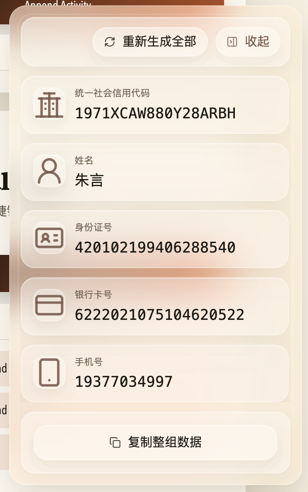
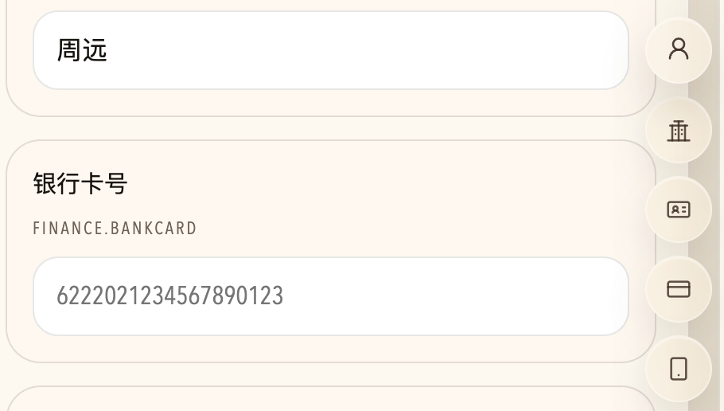

# place-fill

  

  <strong>为表单联调、回归测试和录屏演示准备的 Chrome 填充插件</strong>

  一侧生成测试数据，一侧智能识别输入框，减少重复录入和人工切换。

  
  

## 插件功能

### 生成常用测试数据

- 支持统一社会信用代码、公司名称、姓名、身份证号、银行卡号、手机号、邮箱、固定电话、地址
- 支持单项复制、整组复制和一键重新生成全部数据
- 地址字段按中文业务表单常见格式生成，适合本地联调和演示录屏

### 悬浮面板与快捷操作

- 页面右侧注入可展开、可收起的悬浮面板
- 面板失焦后会自动收起，减少对页面操作的遮挡
- 字段卡片、吸附入口和工具栏统一使用本地图标与本地 logo 资源

### 智能识别与填充

- 聚焦可识别输入框时，会在输入区域旁显示智能填充按钮
- 支持邮箱、手机号、身份证号、银行卡号、姓名、公司名称、统一社会信用代码等常见字段识别
- 支持右键手动标注字段类型，并在当前站点范围内复用标注结果

### 设置与站点控制

- 可按当前站点勾选展示哪些填充项
- 可按当前站点单独开启或关闭智能识别与右键标注
- 支持导出、导入和脱敏导出人工标注数据

## 浏览器导入方法

### Chrome / Edge

1. 前往 [GitHub Releases](https://github.com/coldShan/place-fill/releases) 下载最新版本的 `place-fill-vx.x.x.zip`
2. 将下载的 zip 文件解压到本地任意目录
3. 打开浏览器扩展管理页：`chrome://extensions` 或 `edge://extensions`
4. 打开右上角的“开发者模式”
5. 点击“加载已解压的扩展程序”
6. 选择刚刚解压后的发布包目录
7. 导入完成后，工具栏中会出现 `place-fill` 图标

### 使用提示

- 选择的目录内应直接包含 `manifest.json`
- Release 压缩包解压后就是插件本体文件，不包含额外的 `extension` 外层目录
- 如果修改了插件代码，需要回到扩展管理页点击“重新加载”
